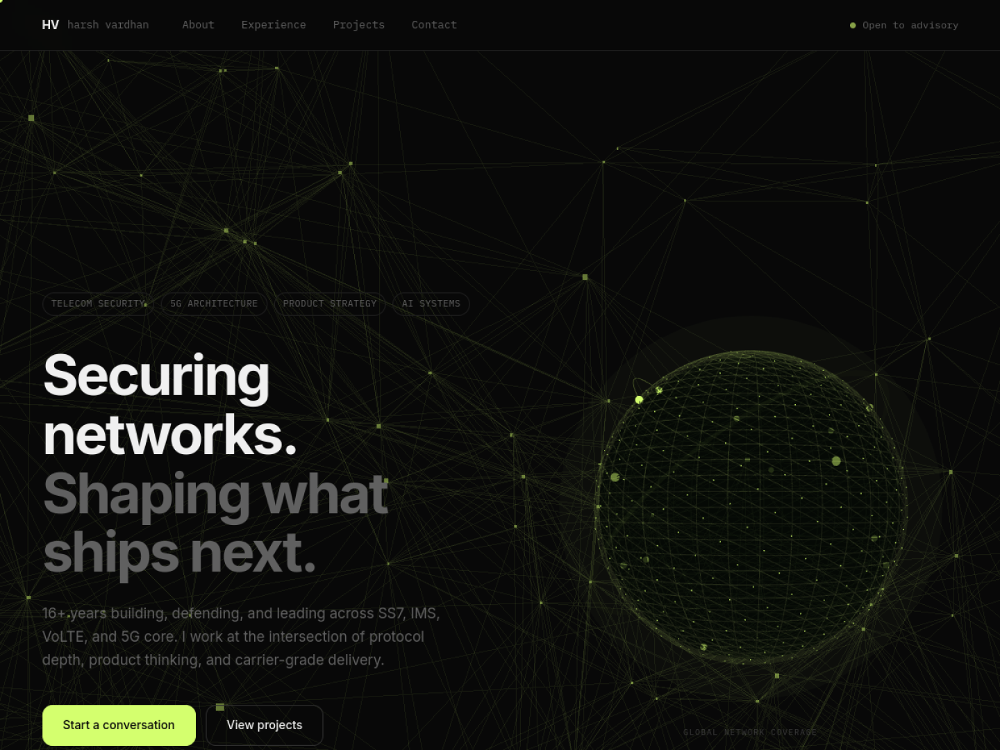

# harsh-portfolio-clean

> A high-performance personal portfolio site with full-page 3D network background, interactive hero globe, and custom telecom-style cursor. Built with pure HTML, CSS, and vanilla JavaScript — **zero frameworks, zero build step.**



**Live site:** [harsh-portfolio-clean.vercel.app](https://harsh-portfolio-clean.vercel.app)

---

## Features

### 3D & Visual
- **Full-page 3D background** — 180 drifting network nodes with connecting edges using Three.js, parallax mouse tracking, scroll-driven camera depth
- **Hero globe** — 600 Fibonacci-distributed surface dots, 10 animated signal arcs between nodes, dual orbital rings, atmospheric glow, mouse-reactive rotation
- **Custom cursor** — Telecom crosshair: lime dot (instant) + lagged ring with smooth lerp, expands on hover, shrinks on click, ripple animation on click
- **Scroll reveal** — IntersectionObserver-driven fade+slide reveal on all sections

### Layout
- Sticky glassmorphism nav with availability indicator
- 2-column hero (text + globe), collapses to single column on tablet
- Full-width stats strip with separators
- 4-column capability pillars grid
- Vertical timeline with dot indicators
- 3-column project card grid with animated arrows
- Full-width blockquote principle section
- 2-column contact (form + channels)

### Performance
- No framework dependencies
- Three.js loaded from CDN (r134)
- PixelRatio capped at 1.5 for background, 2.0 for globe
- ResizeObserver for canvas responsiveness
- Custom cursor disabled on mobile (≤640px) — native cursor restored

---

## Tech Stack

| Layer | Choice | Why |
|-------|--------|-----|
| Structure | HTML5 | Zero build overhead |
| Styling | CSS3 (custom properties, grid, flexbox) | No Tailwind needed |
| 3D | Three.js r134 (CDN) | Mature, well-documented |
| Fonts | Inter + IBM Plex Mono (Google Fonts) | Clean, professional |
| Contact | Formspree | Free, no backend needed |
| Hosting | Vercel | Auto-deploy on push, free tier |

---

## Design Tokens

```css
--bg:         #080808   /* near-black background */
--surface:    #111111   /* card surfaces */
--border:     #1e1e1e   /* subtle borders */
--text:       #f0f0f0   /* primary text */
--muted:      #606060   /* secondary text */
--accent:     #d4ff6e   /* lime — all highlights, globe, cursor */
--font:       "Inter"
--mono:       "IBM Plex Mono"
```

---

## Project Structure

```
harsh-portfolio-clean/
├── index.html          # Full single-page markup
├── styles.css          # All styles (tokens → layout → components → responsive)
├── script.js           # Cursor + reveal + contact form + Three.js scenes
├── screenshots/
│   └── preview.png     # 1440×1080 site preview
├── .github/
│   ├── ISSUE_TEMPLATE/
│   │   ├── bug_report.md
│   │   └── feature_request.md
│   └── CONTRIBUTING.md
└── README.md
```

---

## Local Development

No build step needed. Just open the HTML file:

```bash
# Option 1 — open directly
open index.html

# Option 2 — local server (avoids CORS on fonts)
npx serve .
# or
python3 -m http.server 3000
```

---

## Customization Guide

### Change your name and tagline
Edit `index.html` — update the `<title>`, `<meta>` description, `.nav-brand`, and `.hero-headline`.

### Update stats
In `index.html`, find `.stats-strip` and update the `<strong>` values and labels.

### Add/remove projects
Copy a `.project-card` block in `index.html` and update the `href`, title, description, and language tag.

### Change accent color
One token change in `styles.css`:
```css
--accent: #d4ff6e;       /* change this */
--accent-rgb: 212, 255, 110;  /* must match RGB values of above */
```
This updates globe color, cursor color, timeline dots, section labels, and all hover states.

### Change globe size
In `styles.css`:
```css
#globe-canvas { max-width: 500px; height: 500px; }
```

### Adjust background density
In `script.js`, find `initBackground()`:
```js
const NODE_COUNT = 180;    /* more nodes = denser network */
const THRESHOLD  = 28;     /* higher = more edges drawn */
```

### Update contact form
Replace the Formspree endpoint in `index.html`:
```html
<form action="https://formspree.io/f/YOUR_FORM_ID">
```
Sign up free at [formspree.io](https://formspree.io).

---

## Deployment

### Vercel (recommended)

```bash
# Install Vercel CLI
npm i -g vercel

# Deploy preview
vercel

# Deploy to production
vercel --prod
```

Or connect your GitHub repo at [vercel.com/new](https://vercel.com/new) — every push to `main` auto-deploys.

### Netlify / GitHub Pages

Drop the folder into Netlify drag-and-drop, or enable GitHub Pages from repo Settings → Pages → Deploy from branch `main`.

---

## Browser Support

| Browser | Support |
|---------|---------|
| Chrome / Edge 90+ | Full |
| Firefox 90+ | Full |
| Safari 15+ | Full |
| Mobile Safari / Chrome | Full (custom cursor disabled) |

---

## Performance Notes

- **Background Three.js scene**: ~2ms per frame on modern hardware. Uses `PointsMaterial` (not individual `Mesh` objects) for efficiency.
- **Globe**: Separate renderer and scene from background — isolated draw calls.
- **Fonts**: `rel=preconnect` to Google Fonts CDN.
- **No JS framework**: No React/Vue/Svelte overhead. Total JS (excluding Three.js CDN) < 8KB.

---

## License

MIT — free to use, fork, and adapt. Attribution appreciated but not required.

---

## Author

**Harsh Vardhan Singh Chauhan**
Telecom Security · 5G Architecture · Product Strategy · AI Systems

- LinkedIn: [linkedin.com/in/harsh-vardhan-75865121](https://www.linkedin.com/in/harsh-vardhan-75865121/)
- GitHub: [github.com/ehansih](https://github.com/ehansih)
- Medium: [medium.com/@vardhan.chauhan](https://medium.com/@vardhan.chauhan)

## Security

This site is hardened with the following HTTP security headers, configured via `vercel.json`:

| Header | Value |
|--------|-------|
| `X-Frame-Options` | `SAMEORIGIN` — prevents clickjacking |
| `X-Content-Type-Options` | `nosniff` — prevents MIME sniffing |
| `Referrer-Policy` | `strict-origin-when-cross-origin` |
| `Permissions-Policy` | Camera, mic, geolocation, payment blocked |
| `X-XSS-Protection` | `1; mode=block` |
| `Content-Security-Policy` | Restricts script/style/font sources |

HTTPS and HSTS are enforced automatically by Vercel.
